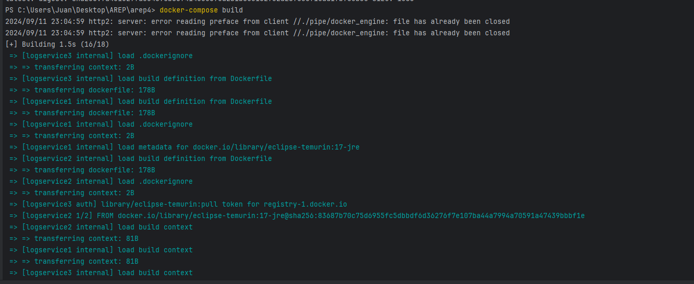
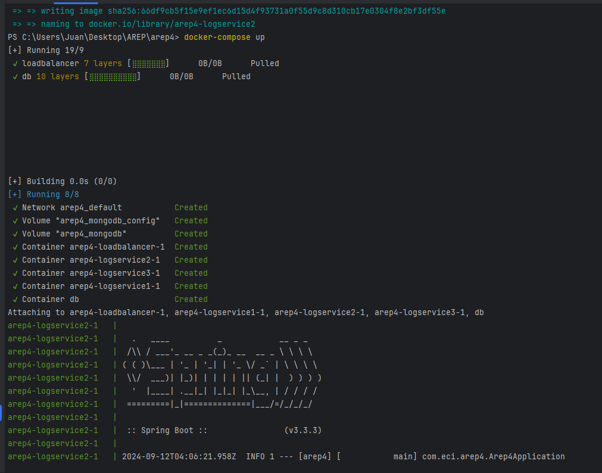
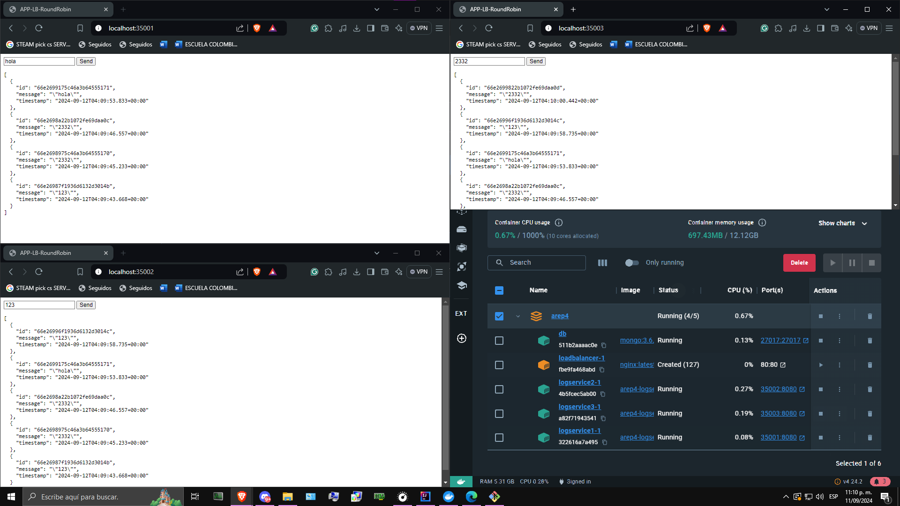
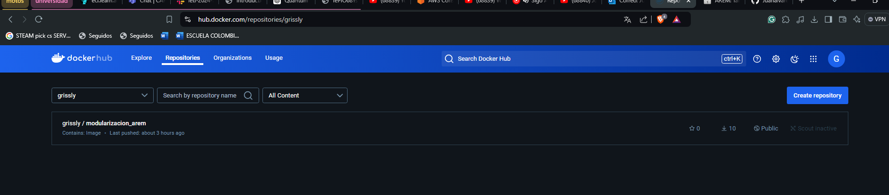
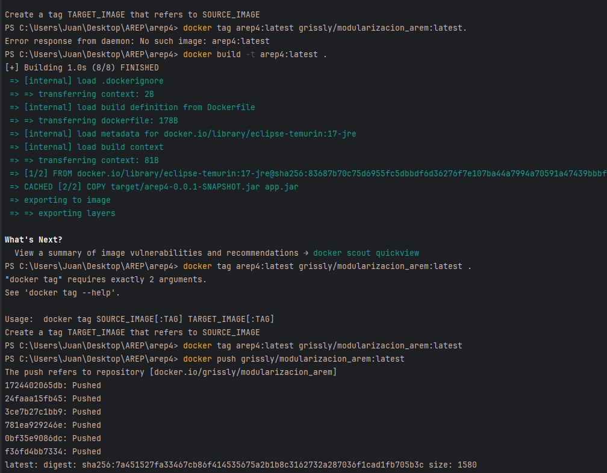
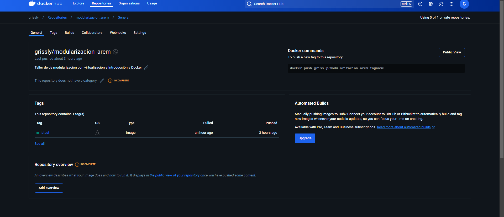

# 🚀 Taller de de modularización con virtualización e Introducción a Docker
El taller consiste en crear una aplicación web pequeña usando el micro-framework de Spark java (http://sparkjava.com/). Una vez tengamos esta aplicación procederemos a construir un container para docker para la aplicación y los desplegaremos y configuraremos en nuestra máquina local. Luego, cerremos un repositorio en DockerHub y subiremos la imagen al repositorio. Finalmente, crearemos una máquina virtual de en AWS, instalaremos Docker , y desplegaremos el contenedor que acabamos de crear.

## 🏛️ Arquitectura
Esta arquitectura sigue el patrón MVC (Modelo-Vista-Controlador) y utiliza Spring Boot para facilitar la creación de aplicaciones Java basadas en microservicios.
### 🔧 Componentes Principales
- **Aplicación Principal (Arep4Application)**:Es el punto de entrada de la aplicación Spring Boot. Se encarga de iniciar la aplicación.
- **Controlador (LogServiceController)**:Define los endpoints REST para manejar las solicitudes HTTP. En este caso, tiene un endpoint /log que recibe mensajes y devuelve los últimos 10 mensajes registrados.
- **Modelo (LogEntry)**:Representa la entidad de datos que se almacena en la base de datos. Contiene campos como id, message y timestamp.
- **Servicio (LogService)**:Contiene la lógica de negocio de la aplicación. Se encarga de guardar los mensajes y recuperar los últimos 10 mensajes.
- **Balanceador de Carga (RoundRobinLoadBalancer)**:Implementa la lógica de balanceo de carga en modo round-robin. Se encarga de delegar mensajes a diferentes instancias de servicio.

### 📦 Flujo de la Aplicación
1. Solicitud HTTP: El cliente envía una solicitud HTTP al endpoint /log.
2. Controlador: LogServiceController recibe la solicitud y la delega al LogService.
3. Servicio: LogService guarda el mensaje en la base de datos y recupera los últimos 10 mensajes.
4. Modelo: LogEntry representa cada mensaje guardado con su id, message y timestamp.
5. Balanceador de Carga: RoundRobinLoadBalancer se encarga de distribuir las solicitudes entre diferentes instancias de servicio si es necesario.

### 📋 Diagrama de Componentes

## 🛠️ Empezando
### ✅ Requisitos Previos

Asegúrate de tener instalados los siguientes componentes:

- [Java JDK 17](https://www.oracle.com/java/technologies/javase-jdk17-downloads.html).
- Un IDE de Java como [IntelliJ IDEA](https://www.jetbrains.com/idea/), [Eclipse](https://www.eclipse.org/downloads/), o [NetBeans](https://netbeans.apache.org/).
- [Maven](https://maven.apache.org/) Manejo de las dependencias.
- DockerHub: [DockerHub](https://hub.docker.com/).
- Revisar pom.xml para más información.
- Un navegador web.

### 📥 Instalación

1. Instala [Git](https://git-scm.com/downloads).
2. Elige una carpeta para alojar el repositorio.
3. Abre la terminal de Git con clic derecho y selecciona "Git Bash Here".
4. Clona el repositorio en tu máquina local:
   ```bash
    git clone https://github.com/JuanalvarezECI/Taller4_AREM.git
   ```
## 🚀 Despliegue
1. Abre el proyecto con tu IDE favorito.
2. Compila el proyecto ejecutando:
   ```bash
   mvn clean install
   ```
4. Empaqueta el proyecto ejecutando:   
   ```bash
   mvn clean package
   ```
5. Ahora construimos las imagenes de docker:
   ```bash
   dokcer-compose build
   ```

6. Una vez creadas las imagenes de docker ejecutamos los contenedores definidos con el siguiente comando, inicializando la apliación:
   ```bash
   dokcer-compose up
   ```  
Verificamos en la consola que todo haya sido creado y sin errores:

7. Ahora, abrimos un navegador web y accedemos a los diferentes endpoints de la aplicación especificados en el diagrama propuesto en el taller para LogService.
- 1. http://localhost:35001/
- 2. http://localhost:35002/
- 3. http://localhost:35003/


## 📦 Despliegue en DockerHub
1. Ingresamos a nuestra cuenta de DockerHub y creamos un repositorio nuevo

2. Ingresamos a la terminal y ejecutamos los siguientes comandos para subir la imagen a DockerHub:
Aqui renombramos una imagen de docker con un nuevo nombre para poder hacer push bajo un nombre especifico.
   ```bash
    docker tag arep4:latest grissly/modularizacion_arem:latest.
   ```
Este comando construye la nueva imagen de docker en el directorio actual y le pone como tag arep:latest
   ```bash
   docker build -t arep4:latest . 
   ```
Finalmente este comando hace un push al repositorio de dockerhub con el nombre de la imagen que se le asigno anteriormente.
   ```bash
   docker push grissly/modularizacion_arem:latest  
   ```

3. Ahora, podemos ver la imagen en DockerHub:
